Avocado Satiety Study
================

## Description

- A secondary analysis of the Habitual Diet and Avocado Trial (HAT), a
  randomized clinical trial of two-arm parallel design
- This study examines how avocado consumption affects energy intake,
  energy density, and meal intervals
- The unit of analysis is eating occasion, either meals or snacks

## Datasets

- There are five data files:
  - `macro_protocol3.xlsx`
    - Includes patient demographics
    - n = 900 participants, `cpartid` are all distinct
  - `HAT_SCMeal.csv`
    - Meal-level data from NDSR
    - Used to identify meals containing avocado (`rfgscmFRU500`, in
      serving size)
    - n = 19,643 meals
  - `meal_timdiff_updated.xlsx`
    - Also meal-level data, but time of the meal and meal order were
      manually corrected
    - Includes `Coding` – what types of error was identified for each
      meal, if any  
    - n = 19,643 meals
  - `Gram_kcal_new2.csv`
    - Also meal-level data, but includes total intake as well as food
      intake (excluding beverages)
    - n = 19,643 meals
  - `HAT_Intake.csv`
    - recall-day-level data
    - Includes day of the week, total kcal per day
    - n = 3901 recall days
- Five datasets were merged together to create an analytic dataset

## Inclusion/exclusion criteria

- Note that the data has a three-level nested structure: Participants -
  Recall day - Meals of the day

- At the participant level:

  - Includes only those in the avocado arm

- At the recall-day level:

  - Excludes baseline food recalls (`DT1`)

- At the meal level:

  - Excludes beverage-only eating occasions
  - Excludes meals with total kcal less than 20 kcal
  - Excludes meals with food kcal less than 0.3 kcal (misclassified as
    meals/snacks, rather than beverages)

- After applying inclusion/exclusion criteria, the analytic data
  include:

  - n = 436 participants, all from the avocado arm
  - n = 1,296 recall days
    - Most of the participants (97.2%) have 3 recall days
    - Twelve participants have only 2 recall days
  - n = 4990 meals

## Outcomes

- Total energy content (kcal) of eating occasions

- Energy density (kcal / grams) of eating occasions

  - If the energy density is greater than 9, this was set to as missing
    (implausible)
    - These meals with density \> 9 will be excluded from the analysis
      on energy density

- Meal interval (in hours), or time passed since the previous eating
  occasion of the day, excluding beverages

  - For the first eating occasion of the day, meal interval is NOT
    calculated (missing)
  - Some meal times were incorrectly recorded and the correct times
    could not be determined – set to missing
    - (`Coding = 3 or 5`; beverage-related? See the email from AC on
      5/18/2026)
  - These meals will be excluded from analysis on meal intervals

## Descriptive analysis

### Participant characteristics

<table>

<thead>

<tr>

<th style="text-align:left;">

</th>

<th style="text-align:left;">

level
</th>

<th style="text-align:left;">

Overall
</th>

</tr>

</thead>

<tbody>

<tr>

<td style="text-align:left;font-weight: bold;">

n
</td>

<td style="text-align:left;">

</td>

<td style="text-align:left;">

436
</td>

</tr>

<tr>

<td style="text-align:left;font-weight: bold;">

Age, years (mean (SD))
</td>

<td style="text-align:left;">

</td>

<td style="text-align:left;">

51.0 (14.3)
</td>

</tr>

<tr>

<td style="text-align:left;font-weight: bold;">

Sex (%)
</td>

<td style="text-align:left;">

F
</td>

<td style="text-align:left;">

313 (71.8)
</td>

</tr>

<tr>

<td style="text-align:left;font-weight: bold;">

</td>

<td style="text-align:left;">

M
</td>

<td style="text-align:left;">

123 (28.2)
</td>

</tr>

<tr>

<td style="text-align:left;font-weight: bold;">

Race/Ethnicity (%)
</td>

<td style="text-align:left;">

Caucasian
</td>

<td style="text-align:left;">

317 (72.7)
</td>

</tr>

<tr>

<td style="text-align:left;font-weight: bold;">

</td>

<td style="text-align:left;">

African American
</td>

<td style="text-align:left;">

59 (13.5)
</td>

</tr>

<tr>

<td style="text-align:left;font-weight: bold;">

</td>

<td style="text-align:left;">

Asian
</td>

<td style="text-align:left;">

24 ( 5.5)
</td>

</tr>

<tr>

<td style="text-align:left;font-weight: bold;">

</td>

<td style="text-align:left;">

Other
</td>

<td style="text-align:left;">

36 ( 8.3)
</td>

</tr>

<tr>

<td style="text-align:left;font-weight: bold;">

Education level (%)
</td>

<td style="text-align:left;">

None
</td>

<td style="text-align:left;">

29 ( 6.7)
</td>

</tr>

<tr>

<td style="text-align:left;font-weight: bold;">

</td>

<td style="text-align:left;">

Vocational school
</td>

<td style="text-align:left;">

51 (11.7)
</td>

</tr>

<tr>

<td style="text-align:left;font-weight: bold;">

</td>

<td style="text-align:left;">

College degree
</td>

<td style="text-align:left;">

231 (53.0)
</td>

</tr>

<tr>

<td style="text-align:left;font-weight: bold;">

</td>

<td style="text-align:left;">

Graduate degree
</td>

<td style="text-align:left;">

125 (28.7)
</td>

</tr>

<tr>

<td style="text-align:left;font-weight: bold;">

Region (%)
</td>

<td style="text-align:left;">

East coast
</td>

<td style="text-align:left;">

216 (49.5)
</td>

</tr>

<tr>

<td style="text-align:left;font-weight: bold;">

</td>

<td style="text-align:left;">

West coast
</td>

<td style="text-align:left;">

220 (50.5)
</td>

</tr>

<tr>

<td style="text-align:left;font-weight: bold;">

BMI category (%)
</td>

<td style="text-align:left;">

Normal
</td>

<td style="text-align:left;">

10 ( 2.3)
</td>

</tr>

<tr>

<td style="text-align:left;font-weight: bold;">

</td>

<td style="text-align:left;">

Overweight
</td>

<td style="text-align:left;">

137 (31.4)
</td>

</tr>

<tr>

<td style="text-align:left;font-weight: bold;">

</td>

<td style="text-align:left;">

Obese
</td>

<td style="text-align:left;">

289 (66.3)
</td>

</tr>

<tr>

<td style="text-align:left;font-weight: bold;">

BMI, kg/m² (mean (SD))
</td>

<td style="text-align:left;">

</td>

<td style="text-align:left;">

32.7 (5.2)
</td>

</tr>

<tr>

<td style="text-align:left;font-weight: bold;">

Waist circumference, cm (mean (SD))
</td>

<td style="text-align:left;">

</td>

<td style="text-align:left;">

109.0 (12.7)
</td>

</tr>

</tbody>

</table>

### Recall day

- Out of 1,296 recall days, about 30% were during weekends
  - The number of recalls on Fridays was notably lower compared to other
    days of the week
- The number of meals/snacks eaten across days of the week appears to be
  consistent
- Meal kcal per day appears to be higher on Saturdays

| Day of the week | No. recalls |     % | Mean \# of meals | Mean kcal/day |
|:----------------|------------:|------:|-----------------:|--------------:|
| Sun             |         211 | 16.28 |             3.81 |       2001.72 |
| Mon             |         219 | 16.90 |             3.83 |       1996.40 |
| Tue             |         226 | 17.44 |             3.87 |       1996.01 |
| Wed             |         198 | 15.28 |             3.74 |       1950.24 |
| Thur            |         177 | 13.66 |             3.90 |       2060.80 |
| Fri             |          92 |  7.10 |             3.89 |       2086.94 |
| Sat             |         173 | 13.35 |             3.95 |       2205.96 |

### Meal-level

#### Meal type

- Definition: Meal type (meal period):
  - Morning meal (00:00 to 11:00)
  - Midday meal (11:01 to 16:59)
  - Evening meal (17:00 to 23:59)
  - Morning snack (00:00 to 11:59)
  - Evening snacks (12:00 to 16:59)
  - Late-night snack (17:00 to 23:59)
- Frequency table by meal/snack and mean energy per meal
  - The number of morning, midday, evening meals were approximately
    equal
  - The number of snacks increases as the day progresses
  - The energy content of meals and snacks also increases as the day
    progresses

| Meal/Snack       | n    | %    | Mean total kcal (SD) | Mean food kcal (SD) |
|:-----------------|:-----|:-----|:---------------------|:--------------------|
| Morning meal     | 1136 | 22.8 | 466.71 (277.65)      | 432.40 (268.25)     |
| Midday meal      | 1127 | 22.6 | 641.17 (356.95)      | 611.38 (340.15)     |
| Evening meal     | 1178 | 23.6 | 745.28 (416.80)      | 692.06 (388.46)     |
| Morning snack    | 326  | 6.5  | 255.31 (332.02)      | 243.39 (316.24)     |
| Midday snack     | 586  | 11.7 | 266.21 (224.17)      | 257.09 (220.56)     |
| Late night snack | 637  | 12.8 | 306.48 (260.18)      | 280.26 (232.30)     |

- A density plot of food kcal by meal and snack type shows a similar
  trend

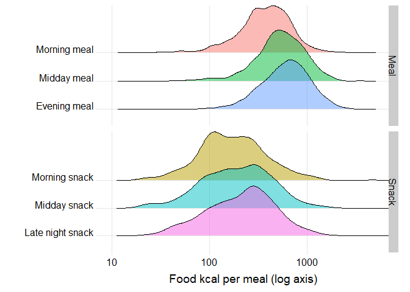<!-- -->

#### Meal place

- Meal place
  - Among 4,990 meals, 68% of them were eaten at home or friend’s home
  - The energy content was much higher when eaten at delis/restaurants
    or ordering takeout

| Meal place | n | % | Mean total kcal (SD) | Mean food kcal (SD) |
|:---|:---|:---|:---|:---|
| Home/Friend’s home | 3401 | 68.2 | 490.55 (353.83) | 459.50 (337.55) |
| Work/School | 802 | 16.1 | 440.81 (326.28) | 425.18 (318.40) |
| Deli/Take-out/Restaurant | 530 | 10.6 | 789.61 (441.21) | 728.33 (397.96) |
| Daycare/Party/Travelling/Other | 256 | 5.1 | 484.45 (452.00) | 443.32 (412.07) |

### Outcomes

#### Energy content (food kcal)

- The distribution of food kcal per meal/snack is right-skewed
  - The mean (SD) food kcal was 482 (355.3) kcal

|  Min |    Q1 | Median |  Mean |    SD |    Q3 |    Max |
|-----:|------:|-------:|------:|------:|------:|-------:|
| 16.5 | 229.9 |  406.6 | 481.8 | 356.1 | 642.3 | 4618.5 |

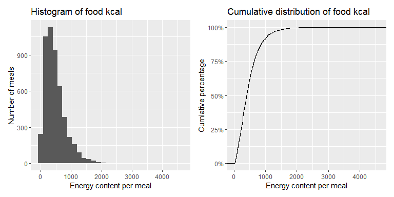<!-- -->

#### Energy density

- The distribution of food density is slightly right-skewed
  - The mean (SD) food density was 2.17 (1.31) kcal/g

|  Min |   Q1 | Median | Mean |   SD |   Q3 |  Max |
|-----:|-----:|-------:|-----:|-----:|-----:|-----:|
| 0.07 | 1.27 |   1.82 | 2.17 | 1.31 | 2.68 | 6.91 |

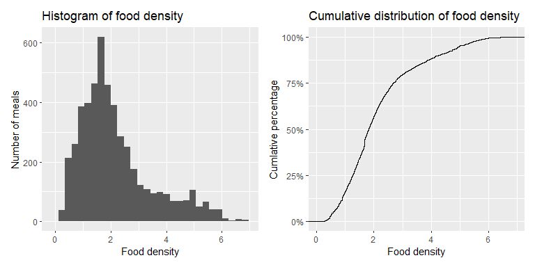<!-- -->

#### Meal interval

|  Min |   Q1 | Median | Mean |   SD |  Q3 | Max |
|-----:|-----:|-------:|-----:|-----:|----:|----:|
| 0.25 | 2.25 |    3.5 | 3.75 | 1.96 |   5 |  14 |

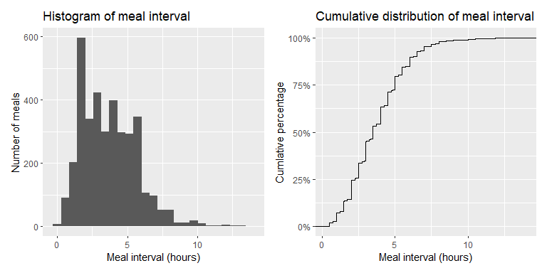<!-- -->

### Avocado intake

#### Distribution of avocado intake

- A histogram of avocado intake (grams) per meal/snack is shown below
  - The distribution of avocado intake per meal was trimodal, with the
    three largest bars corresponding to:
    - No avocado (0 grams) – 70% of all meals
    - One-half (84 grams) – 7.4%
    - One whole avocado (168 grams) – 20%
  - The max avocado intake per meal was 504 grams

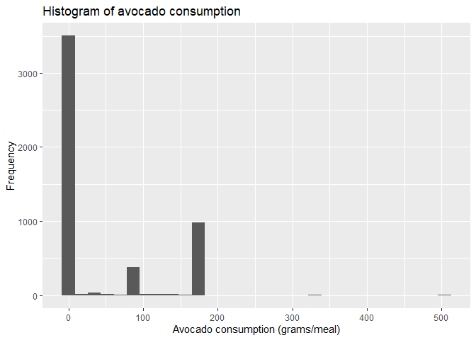<!-- -->

- Given the distribution of avocado, meals/snaks were categorized into
  the following 3 groups by avocado consumption:

| Avocado intake          |    n |    % |
|:------------------------|-----:|-----:|
| No avocado at all       | 3492 | 70.0 |
| \<1 avocado             |  503 | 10.1 |
| 1 whole avocado or more |  995 | 19.9 |

#### Food kcal by meal type and avocado intake

- Mean (SD) food kcal by meal type and avocado intake are shown below:
  - Food kcal increases with avocado intake for both meals and snacks

| Meal type | No avocado:  N | No avocado:  Mean ± SD | \<1 avocado:  N | \<1 avocado:  Mean ± SD | 1+ avocado:  N | 1+ avocado:  Mean ± SD |
|:---|---:|:---|---:|:---|---:|:---|
| Morning meal | 714 | 385 ± 269 | 138 | 445 ± 209 | 284 | 545 ± 259 |
| Midday meal | 696 | 569 ± 344 | 150 | 556 ± 242 | 281 | 745 ± 342 |
| Evening meal | 792 | 644 ± 378 | 144 | 669 ± 333 | 242 | 863 ± 406 |
| Morning snack | 276 | 223 ± 324 | 20 | 243 ± 115 | 30 | 435 ± 277 |
| Midday snack | 486 | 236 ± 225 | 26 | 249 ± 116 | 74 | 401 ± 160 |
| Late night snack | 528 | 264 ± 242 | 25 | 361 ± 263 | 84 | 361 ± 111 |

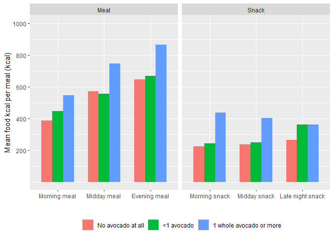<!-- -->

#### Food density by meal type and avocado intake

- Mean (SD) food density by meal type and avocado intake are shown
  below:
  - Food density decreases with avocado intake for meals

| Meal type | No avocado:  N | No avocado:  Mean ± SD | \<1 avocado:  N | \<1 avocado:  Mean ± SD | 1+ avocado:  N | 1+ avocado:  Mean ± SD |
|:---|---:|:---|---:|:---|---:|:---|
| Morning meal | 714 | 2.15 ± 1.14 | 138 | 1.81 ± 0.53 | 284 | 1.68 ± 0.38 |
| Midday meal | 696 | 1.92 ± 0.94 | 150 | 1.69 ± 0.56 | 281 | 1.64 ± 0.52 |
| Evening meal | 792 | 1.78 ± 0.81 | 144 | 1.64 ± 0.5 | 242 | 1.64 ± 0.48 |
| Morning snack | 276 | 2.66 ± 1.9 | 20 | 1.53 ± 0.51 | 30 | 1.76 ± 0.47 |
| Midday snack | 486 | 3.25 ± 1.86 | 26 | 1.81 ± 0.71 | 74 | 1.71 ± 0.37 |
| Late night snack | 528 | 3.27 ± 1.76 | 25 | 1.65 ± 0.74 | 84 | 1.7 ± 0.33 |

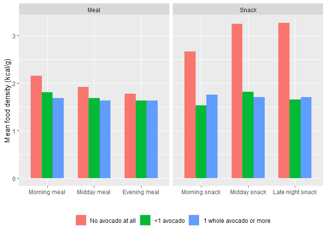<!-- -->

#### Prior avocado intake

- Among 3,694 meals/snacks (excluding the first eating occasions of the
  day), 69% of the meals/snack did not have any avocado intake at the
  preceding eating occasion
  - The meal interval appears to increase with greater avocado intake at
    the preceding eating occasion
  - The mean energy intake (from food) was lowest when less than one
    avocado was consumed at the preceding eating occasion

| Prior avocado intake | n | % | Mean meal interval (SD) | Mean food kcal (SD) |
|:---|---:|---:|:---|:---|
| No avocado at all | 2556 | 69.19 | 3.62 ± 1.89 | 509.8 ± 377.6 |
| \<1 avocado | 390 | 10.56 | 3.88 ± 2.06 | 409.7 ± 301.5 |
| 1 whole avocado or more | 748 | 20.25 | 4.13 ± 2.09 | 487.8 ± 402.7 |

- When stratified by meal type, the meal interval increased with greater
  avocado intake at the preceding eating occasion for midday and evening
  meals, but not for morning meals

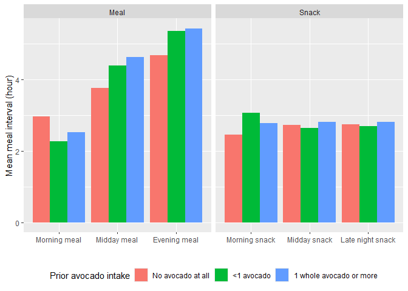<!-- -->

- When stratified by meal type, the mean energy content was lowest when
  less than one avocado was consumed at the preceding eating occasion
  for all meals (morning, midday, and evening meals)
  - For snacks, the mean energy content was highest when no avocado was
    consumed at the preceding eating occasion

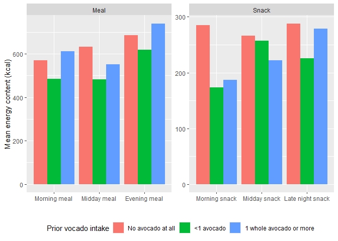<!-- -->

## Linear Mixed Models

### Descriptions of the models

- To examine the effect of avocado consumption on three outcomes – meal
  energy intake (kcal from food), dietary energy density (kcal/g), and
  mealtime interval (hours between consecutive eating occasions) – we
  fitted separate linear mixed effects models for each outcome using the
  `lme` function from the `nlme` package in R

- Each model accounted for the three-level nested structure of the data,
  where eating occasions (level 1) were nested within recall days (level
  2), which were in turn nested within participants (level 3)

- The same covariance structure was applied across all three models,
  with an unstructured G matrix at the participant level to capture
  between-person variability in both baseline outcomes and
  recall-to-recall changes, and a continuous autoregressive structure
  for the R matrix to account for the correlation among meals consumed
  within the same recall day. This approach recognizes that two meals
  eaten close together in time are more likely to influence each other
  than two meals eaten far apart

### Covariates

- All models included the following covariates:
  - Age at baseline (as continuous)
  - Sex (female as reference)
  - Race (Caucasian as reference)
  - BMI (as continuous)
  - Residential region (East/West coast, East coast as reference)
  - Day of the week (weekdays or weekends, weekday as reference)
  - Total daily kcal (as continuous, per 100 kcal)
  - Meal type (evening meal as reference)
  - Meal environment (4 levels as shown above; Home/Friend’s home as
    reference)
  - Meal frequency (as continuous)

### Outcomes

- Three outcomes were examined: meal energy intake (kcal), dietary
  energy density (kcal/g), and mealtime interval (hours)
  - Given the severe right-skewed distribution of meal energy intake,
    this outcome was log-transformed prior to analysis
  - No transformation was applied to energy density or mealtime interval
- To examine the effect of avocado consumption on meal energy intake and
  dietary energy density, the models additionally included:
  - Avocado consumption at the same eating occasion as a categorical
    variable (no avocado as the reference category),
  - along with its interaction with meal type where statistically
    significant
- For the subsequent meal models:
  - Avocado intake at the preceding eating occasion was included as the
    main exposure,
  - again with its interaction with meal type retained where
    statistically significant
- For each outcome, estimated marginal means (EMMs) with 95% confidence
  intervals were derived from the fitted models using the `emmeans`
  package in R, averaging over all other covariates in the model at
  their observed distributions
  - For meal energy intake, where a log transformation was applied prior
    to analysis, EMMs were back-transformed to the original scale for
    interpretability and are therefore reported as geometric means with
    95% confidence intervals
- The assumptions of the linear mixed models were examined using
  normalized (decorrelated) residuals. No severe departures from
  normality were observed. All analyses were conducted in R version
  4.5.3.

## Model results

### Effect of avocado consumption on meal energy intake

- The interaction between meal type and avocado intake was highly
  significant (p \<.0001),
  - suggesting that the effects of avocado intake on meal energy content
    differed across meal types
- Among the covariates:
  - Age, sex, race/ethinicity, BMI, region, and day of the week were not
    statistically significant
  - Meal environment, meal frequency, daily energy intake were all
    highly significant (p \<.0001)
    - Meal environment: Significantly higher kcal for
      “Deli/Take-out/Restaurant” and “Daycare/Party/Travelling/Other”
    - Meal frequency: Higher the frequency, lower the energy intake
    - Daily energy intake: Higher the daily kcal, higher the meal kcal
- The table below presents estimated marginal means of meal energy
  intake by meal type and avocado intake category,
  - adjusted for all covariates in the model and
  - back-transformed to the original scale (kcal)
- The last two columns show Tukey-adjusted p-values comparing against
  the no-avocado meals and against the \<1 avocado meals, respectively
  - Across all meal types, meal energy content increased with avocado
    intake
  - Most pairwise comparisons within the same meal type were
    significant, with two exceptions:
    - \<1 avocado vs 1+ avocado comparison in the morning meal
    - \<1 avocado vs 1+ avocado comparison in the late-night snack

<table class="table" style="color: black; margin-left: auto; margin-right: auto;">

<thead>

<tr>

<th style="text-align:left;">

Meal type
</th>

<th style="text-align:left;">

Avocado intake
</th>

<th style="text-align:right;">

Adjusted mean
</th>

<th style="text-align:right;">

Lower 95% CL
</th>

<th style="text-align:right;">

Upper 95% CL
</th>

<th style="text-align:right;">

p-val: vs No avocado
</th>

<th style="text-align:right;">

p-val: vs \<1 avocado
</th>

</tr>

</thead>

<tbody>

<tr>

<td style="text-align:left;vertical-align: top !important;" rowspan="3">

Morning meal
</td>

<td style="text-align:left;">

No avocado at all
</td>

<td style="text-align:right;">

303.6
</td>

<td style="text-align:right;">

291.1
</td>

<td style="text-align:right;">

316.7
</td>

<td style="text-align:right;">

</td>

<td style="text-align:right;">

</td>

</tr>

<tr>

<td style="text-align:left;">

\<1 avocado
</td>

<td style="text-align:right;">

445.8
</td>

<td style="text-align:right;">

405.0
</td>

<td style="text-align:right;">

490.7
</td>

<td style="text-align:right;">

\<0.0001
</td>

<td style="text-align:right;">

</td>

</tr>

<tr>

<td style="text-align:left;">

1 whole avocado or more
</td>

<td style="text-align:right;">

503.8
</td>

<td style="text-align:right;">

471.0
</td>

<td style="text-align:right;">

538.8
</td>

<td style="text-align:right;">

\<0.0001
</td>

<td style="text-align:right;">

0.0988
</td>

</tr>

<tr>

<td style="text-align:left;vertical-align: top !important;" rowspan="3">

Midday meal
</td>

<td style="text-align:left;">

No avocado at all
</td>

<td style="text-align:right;">

441.8
</td>

<td style="text-align:right;">

422.9
</td>

<td style="text-align:right;">

461.5
</td>

<td style="text-align:right;">

</td>

<td style="text-align:right;">

</td>

</tr>

<tr>

<td style="text-align:left;">

\<1 avocado
</td>

<td style="text-align:right;">

544.7
</td>

<td style="text-align:right;">

496.7
</td>

<td style="text-align:right;">

597.4
</td>

<td style="text-align:right;">

0.0002
</td>

<td style="text-align:right;">

</td>

</tr>

<tr>

<td style="text-align:left;">

1 whole avocado or more
</td>

<td style="text-align:right;">

655.9
</td>

<td style="text-align:right;">

612.8
</td>

<td style="text-align:right;">

701.9
</td>

<td style="text-align:right;">

\<0.0001
</td>

<td style="text-align:right;">

0.0040
</td>

</tr>

<tr>

<td style="text-align:left;vertical-align: top !important;" rowspan="3">

Evening meal
</td>

<td style="text-align:left;">

No avocado at all
</td>

<td style="text-align:right;">

524.3
</td>

<td style="text-align:right;">

503.4
</td>

<td style="text-align:right;">

546.1
</td>

<td style="text-align:right;">

</td>

<td style="text-align:right;">

</td>

</tr>

<tr>

<td style="text-align:left;">

\<1 avocado
</td>

<td style="text-align:right;">

605.0
</td>

<td style="text-align:right;">

550.4
</td>

<td style="text-align:right;">

664.9
</td>

<td style="text-align:right;">

0.0165
</td>

<td style="text-align:right;">

</td>

</tr>

<tr>

<td style="text-align:left;">

1 whole avocado or more
</td>

<td style="text-align:right;">

739.8
</td>

<td style="text-align:right;">

687.4
</td>

<td style="text-align:right;">

796.2
</td>

<td style="text-align:right;">

\<0.0001
</td>

<td style="text-align:right;">

0.0026
</td>

</tr>

<tr>

<td style="text-align:left;vertical-align: top !important;" rowspan="3">

Morning snack
</td>

<td style="text-align:left;">

No avocado at all
</td>

<td style="text-align:right;">

166.2
</td>

<td style="text-align:right;">

155.0
</td>

<td style="text-align:right;">

178.1
</td>

<td style="text-align:right;">

</td>

<td style="text-align:right;">

</td>

</tr>

<tr>

<td style="text-align:left;">

\<1 avocado
</td>

<td style="text-align:right;">

243.8
</td>

<td style="text-align:right;">

189.4
</td>

<td style="text-align:right;">

313.8
</td>

<td style="text-align:right;">

0.0107
</td>

<td style="text-align:right;">

</td>

</tr>

<tr>

<td style="text-align:left;">

1 whole avocado or more
</td>

<td style="text-align:right;">

391.6
</td>

<td style="text-align:right;">

318.9
</td>

<td style="text-align:right;">

480.9
</td>

<td style="text-align:right;">

\<0.0001
</td>

<td style="text-align:right;">

0.0114
</td>

</tr>

<tr>

<td style="text-align:left;vertical-align: top !important;" rowspan="3">

Midday snack
</td>

<td style="text-align:left;">

No avocado at all
</td>

<td style="text-align:right;">

179.8
</td>

<td style="text-align:right;">

170.7
</td>

<td style="text-align:right;">

189.4
</td>

<td style="text-align:right;">

</td>

<td style="text-align:right;">

</td>

</tr>

<tr>

<td style="text-align:left;">

\<1 avocado
</td>

<td style="text-align:right;">

252.2
</td>

<td style="text-align:right;">

202.3
</td>

<td style="text-align:right;">

314.4
</td>

<td style="text-align:right;">

0.0093
</td>

<td style="text-align:right;">

</td>

</tr>

<tr>

<td style="text-align:left;">

1 whole avocado or more
</td>

<td style="text-align:right;">

382.9
</td>

<td style="text-align:right;">

336.0
</td>

<td style="text-align:right;">

436.4
</td>

<td style="text-align:right;">

\<0.0001
</td>

<td style="text-align:right;">

0.0039
</td>

</tr>

<tr>

<td style="text-align:left;vertical-align: top !important;" rowspan="3">

Late night snack
</td>

<td style="text-align:left;">

No avocado at all
</td>

<td style="text-align:right;">

197.3
</td>

<td style="text-align:right;">

187.7
</td>

<td style="text-align:right;">

207.3
</td>

<td style="text-align:right;">

</td>

<td style="text-align:right;">

</td>

</tr>

<tr>

<td style="text-align:left;">

\<1 avocado
</td>

<td style="text-align:right;">

307.1
</td>

<td style="text-align:right;">

245.3
</td>

<td style="text-align:right;">

384.6
</td>

<td style="text-align:right;">

0.0005
</td>

<td style="text-align:right;">

</td>

</tr>

<tr>

<td style="text-align:left;">

1 whole avocado or more
</td>

<td style="text-align:right;">

346.7
</td>

<td style="text-align:right;">

306.6
</td>

<td style="text-align:right;">

392.1
</td>

<td style="text-align:right;">

\<0.0001
</td>

<td style="text-align:right;">

0.6211
</td>

</tr>

</tbody>

</table>

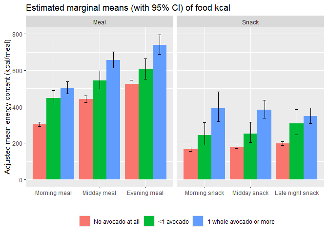<!-- -->

### Effect of avocado consumption on energy density

- The interaction between meal type and avocado intake was highly
  significant (p \<.0001),

  - suggesting that the effects of avocado intake on energy density
    differed across meal types

- Among the covariates:

  - Age, sex, BMI, day of the week, and daily were not statistically
    significant
  - The following covariates were significant:
    - Race/ethnicity (p = 0.038, lower density among Asians)
    - Region (p = 0.021, higher density in the west coast)
    - Meal environment (p = 0.004, higher density in
      “Daycare/Party/Travelling/Other”)
    - Meal frequency (p = 0.002, higher the frequency, lower the
      density)

- The table below presents estimated marginal means of energy density by
  meal type and avocado intake category, adjusted for all covariates in
  the model

- Overall, energy density tended to be highest in meals that did not
  include any avocado

  - Among snacks, energy density was significantly higher in snacks
    containing no avocado compared to snacks containing \<1 avocado or
    1+ avocados, across all snack periods (morning, midday, and
    late-night). The difference between the latter two was not
    statistically significant.
  - Among meals, significant differences were found in three
    comparisons:
    - no avocado vs \<1 avocado in the morning meal
    - no avocado vs 1+ avocado in the morning meal
    - \<1 avocado vs 1+ avocado in the midday meal

<table class="table" style="color: black; margin-left: auto; margin-right: auto;">

<thead>

<tr>

<th style="text-align:left;">

Meal type
</th>

<th style="text-align:left;">

Avocado intake
</th>

<th style="text-align:right;">

Adjusted mean
</th>

<th style="text-align:right;">

Lower 95% CL
</th>

<th style="text-align:right;">

Upper 95% CL
</th>

<th style="text-align:right;">

p-val: vs No avocado
</th>

<th style="text-align:right;">

p-val: vs \<1 avocado
</th>

</tr>

</thead>

<tbody>

<tr>

<td style="text-align:left;vertical-align: top !important;" rowspan="3">

Morning meal
</td>

<td style="text-align:left;">

No avocado at all
</td>

<td style="text-align:right;">

2.13
</td>

<td style="text-align:right;">

2.05
</td>

<td style="text-align:right;">

2.22
</td>

<td style="text-align:right;">

</td>

<td style="text-align:right;">

</td>

</tr>

<tr>

<td style="text-align:left;">

\<1 avocado
</td>

<td style="text-align:right;">

1.86
</td>

<td style="text-align:right;">

1.66
</td>

<td style="text-align:right;">

2.05
</td>

<td style="text-align:right;">

0.0269
</td>

<td style="text-align:right;">

</td>

</tr>

<tr>

<td style="text-align:left;">

1 whole avocado or more
</td>

<td style="text-align:right;">

1.69
</td>

<td style="text-align:right;">

1.56
</td>

<td style="text-align:right;">

1.83
</td>

<td style="text-align:right;">

\<0.0001
</td>

<td style="text-align:right;">

0.3641
</td>

</tr>

<tr>

<td style="text-align:left;vertical-align: top !important;" rowspan="3">

Midday meal
</td>

<td style="text-align:left;">

No avocado at all
</td>

<td style="text-align:right;">

1.90
</td>

<td style="text-align:right;">

1.82
</td>

<td style="text-align:right;">

1.99
</td>

<td style="text-align:right;">

</td>

<td style="text-align:right;">

</td>

</tr>

<tr>

<td style="text-align:left;">

\<1 avocado
</td>

<td style="text-align:right;">

1.71
</td>

<td style="text-align:right;">

1.53
</td>

<td style="text-align:right;">

1.90
</td>

<td style="text-align:right;">

0.1596
</td>

<td style="text-align:right;">

</td>

</tr>

<tr>

<td style="text-align:left;">

1 whole avocado or more
</td>

<td style="text-align:right;">

1.62
</td>

<td style="text-align:right;">

1.49
</td>

<td style="text-align:right;">

1.76
</td>

<td style="text-align:right;">

0.0019
</td>

<td style="text-align:right;">

0.7238
</td>

</tr>

<tr>

<td style="text-align:left;vertical-align: top !important;" rowspan="3">

Evening meal
</td>

<td style="text-align:left;">

No avocado at all
</td>

<td style="text-align:right;">

1.78
</td>

<td style="text-align:right;">

1.70
</td>

<td style="text-align:right;">

1.86
</td>

<td style="text-align:right;">

</td>

<td style="text-align:right;">

</td>

</tr>

<tr>

<td style="text-align:left;">

\<1 avocado
</td>

<td style="text-align:right;">

1.65
</td>

<td style="text-align:right;">

1.46
</td>

<td style="text-align:right;">

1.83
</td>

<td style="text-align:right;">

0.4003
</td>

<td style="text-align:right;">

</td>

</tr>

<tr>

<td style="text-align:left;">

1 whole avocado or more
</td>

<td style="text-align:right;">

1.61
</td>

<td style="text-align:right;">

1.46
</td>

<td style="text-align:right;">

1.76
</td>

<td style="text-align:right;">

0.1179
</td>

<td style="text-align:right;">

0.9596
</td>

</tr>

<tr>

<td style="text-align:left;vertical-align: top !important;" rowspan="3">

Morning snack
</td>

<td style="text-align:left;">

No avocado at all
</td>

<td style="text-align:right;">

2.67
</td>

<td style="text-align:right;">

2.53
</td>

<td style="text-align:right;">

2.81
</td>

<td style="text-align:right;">

</td>

<td style="text-align:right;">

</td>

</tr>

<tr>

<td style="text-align:left;">

\<1 avocado
</td>

<td style="text-align:right;">

1.54
</td>

<td style="text-align:right;">

1.03
</td>

<td style="text-align:right;">

2.04
</td>

<td style="text-align:right;">

0.0001
</td>

<td style="text-align:right;">

</td>

</tr>

<tr>

<td style="text-align:left;">

1 whole avocado or more
</td>

<td style="text-align:right;">

1.77
</td>

<td style="text-align:right;">

1.35
</td>

<td style="text-align:right;">

2.18
</td>

<td style="text-align:right;">

0.0001
</td>

<td style="text-align:right;">

0.7660
</td>

</tr>

<tr>

<td style="text-align:left;vertical-align: top !important;" rowspan="3">

Midday snack
</td>

<td style="text-align:left;">

No avocado at all
</td>

<td style="text-align:right;">

3.27
</td>

<td style="text-align:right;">

3.17
</td>

<td style="text-align:right;">

3.38
</td>

<td style="text-align:right;">

</td>

<td style="text-align:right;">

</td>

</tr>

<tr>

<td style="text-align:left;">

\<1 avocado
</td>

<td style="text-align:right;">

1.82
</td>

<td style="text-align:right;">

1.37
</td>

<td style="text-align:right;">

2.26
</td>

<td style="text-align:right;">

\<0.0001
</td>

<td style="text-align:right;">

</td>

</tr>

<tr>

<td style="text-align:left;">

1 whole avocado or more
</td>

<td style="text-align:right;">

1.72
</td>

<td style="text-align:right;">

1.46
</td>

<td style="text-align:right;">

1.98
</td>

<td style="text-align:right;">

\<0.0001
</td>

<td style="text-align:right;">

0.9256
</td>

</tr>

<tr>

<td style="text-align:left;vertical-align: top !important;" rowspan="3">

Late night snack
</td>

<td style="text-align:left;">

No avocado at all
</td>

<td style="text-align:right;">

3.29
</td>

<td style="text-align:right;">

3.19
</td>

<td style="text-align:right;">

3.39
</td>

<td style="text-align:right;">

</td>

<td style="text-align:right;">

</td>

</tr>

<tr>

<td style="text-align:left;">

\<1 avocado
</td>

<td style="text-align:right;">

1.67
</td>

<td style="text-align:right;">

1.22
</td>

<td style="text-align:right;">

2.12
</td>

<td style="text-align:right;">

\<0.0001
</td>

<td style="text-align:right;">

</td>

</tr>

<tr>

<td style="text-align:left;">

1 whole avocado or more
</td>

<td style="text-align:right;">

1.69
</td>

<td style="text-align:right;">

1.45
</td>

<td style="text-align:right;">

1.94
</td>

<td style="text-align:right;">

\<0.0001
</td>

<td style="text-align:right;">

0.9946
</td>

</tr>

</tbody>

</table>

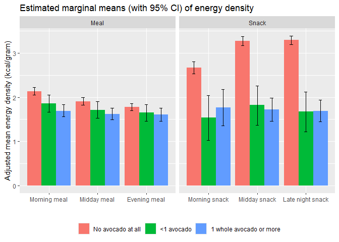<!-- -->

### Effect of preceding avocado consumption on meal energy intake

- The interaction between meal type and preceding avocado intake was
  statistically significant (p = 0.010),
  - suggesting that the effects of preceding avocado intake on meal
    energy content differed across meal types
- Among the covariates:
  - Age, sex, race/ethinicity, BMI, region, and day of the week were not
    statistically significant
  - Meal environment, meal frequency, daily energy intake were all
    highly significant (p \<.0001)
    - Meal environment: Significantly higher kcal for
      “Deli/Take-out/Restaurant”
    - Meal frequency: Higher the frequency, lower the energy intake
    - Daily energy intake: Higher the daily kcal, higher the meal kcal
- The table below presents estimated marginal means of meal energy
  intake by meal type and preceding avocado intake category,
  - adjusted for all covariates in the model and
  - back-transformed to the original scale (kcal)
- For midday meals, the absence of avocado in the preceding eating
  occasion was associated with significantly higher energy content in
  the subsequent meal, compared to when any amount of avocado was
  consumed
  - No significant differences were found for the morning or evening
    meals
- For morning snacks, a similar pattern was observed – the absence of
  avocado in the preceding eating occasion was associated with
  significantly higher energy content in the subsequent eating occasion
  - For midday snacks, energy content was significantly lower when 1+
    avocado was consumed in the preceding eating occasion compared to
    when none or \<1 avocado was consumed

<table class="table" style="color: black; margin-left: auto; margin-right: auto;">

<thead>

<tr>

<th style="text-align:left;">

Meal type
</th>

<th style="text-align:left;">

Preceding avocado intake
</th>

<th style="text-align:right;">

Adjusted mean
</th>

<th style="text-align:right;">

Lower 95% CL
</th>

<th style="text-align:right;">

Upper 95% CL
</th>

<th style="text-align:right;">

p-val: vs No avocado
</th>

<th style="text-align:right;">

p-val: vs \<1 avocado
</th>

</tr>

</thead>

<tbody>

<tr>

<td style="text-align:left;vertical-align: top !important;" rowspan="3">

Morning meal
</td>

<td style="text-align:left;">

No avocado at all
</td>

<td style="text-align:right;">

464.7
</td>

<td style="text-align:right;">

400.6
</td>

<td style="text-align:right;">

539.1
</td>

<td style="text-align:right;">

</td>

<td style="text-align:right;">

</td>

</tr>

<tr>

<td style="text-align:left;">

\<1 avocado
</td>

<td style="text-align:right;">

508.0
</td>

<td style="text-align:right;">

349.1
</td>

<td style="text-align:right;">

739.3
</td>

<td style="text-align:right;">

0.9010
</td>

<td style="text-align:right;">

</td>

</tr>

<tr>

<td style="text-align:left;">

1 whole avocado or more
</td>

<td style="text-align:right;">

354.7
</td>

<td style="text-align:right;">

263.9
</td>

<td style="text-align:right;">

476.9
</td>

<td style="text-align:right;">

0.2442
</td>

<td style="text-align:right;">

0.3019
</td>

</tr>

<tr>

<td style="text-align:left;vertical-align: top !important;" rowspan="3">

Midday meal
</td>

<td style="text-align:left;">

No avocado at all
</td>

<td style="text-align:right;">

532.3
</td>

<td style="text-align:right;">

508.0
</td>

<td style="text-align:right;">

557.9
</td>

<td style="text-align:right;">

</td>

<td style="text-align:right;">

</td>

</tr>

<tr>

<td style="text-align:left;">

\<1 avocado
</td>

<td style="text-align:right;">

429.5
</td>

<td style="text-align:right;">

380.9
</td>

<td style="text-align:right;">

484.2
</td>

<td style="text-align:right;">

0.0029
</td>

<td style="text-align:right;">

</td>

</tr>

<tr>

<td style="text-align:left;">

1 whole avocado or more
</td>

<td style="text-align:right;">

435.9
</td>

<td style="text-align:right;">

400.9
</td>

<td style="text-align:right;">

474.0
</td>

<td style="text-align:right;">

0.0001
</td>

<td style="text-align:right;">

0.9777
</td>

</tr>

<tr>

<td style="text-align:left;vertical-align: top !important;" rowspan="3">

Evening meal
</td>

<td style="text-align:left;">

No avocado at all
</td>

<td style="text-align:right;">

571.5
</td>

<td style="text-align:right;">

547.8
</td>

<td style="text-align:right;">

596.2
</td>

<td style="text-align:right;">

</td>

<td style="text-align:right;">

</td>

</tr>

<tr>

<td style="text-align:left;">

\<1 avocado
</td>

<td style="text-align:right;">

556.3
</td>

<td style="text-align:right;">

496.2
</td>

<td style="text-align:right;">

623.7
</td>

<td style="text-align:right;">

0.8999
</td>

<td style="text-align:right;">

</td>

</tr>

<tr>

<td style="text-align:left;">

1 whole avocado or more
</td>

<td style="text-align:right;">

540.3
</td>

<td style="text-align:right;">

499.1
</td>

<td style="text-align:right;">

584.9
</td>

<td style="text-align:right;">

0.4251
</td>

<td style="text-align:right;">

0.9088
</td>

</tr>

<tr>

<td style="text-align:left;vertical-align: top !important;" rowspan="3">

Morning snack
</td>

<td style="text-align:left;">

No avocado at all
</td>

<td style="text-align:right;">

210.6
</td>

<td style="text-align:right;">

192.1
</td>

<td style="text-align:right;">

230.8
</td>

<td style="text-align:right;">

</td>

<td style="text-align:right;">

</td>

</tr>

<tr>

<td style="text-align:left;">

\<1 avocado
</td>

<td style="text-align:right;">

146.9
</td>

<td style="text-align:right;">

119.1
</td>

<td style="text-align:right;">

181.2
</td>

<td style="text-align:right;">

0.0053
</td>

<td style="text-align:right;">

</td>

</tr>

<tr>

<td style="text-align:left;">

1 whole avocado or more
</td>

<td style="text-align:right;">

151.7
</td>

<td style="text-align:right;">

128.3
</td>

<td style="text-align:right;">

179.4
</td>

<td style="text-align:right;">

0.0020
</td>

<td style="text-align:right;">

0.9689
</td>

</tr>

<tr>

<td style="text-align:left;vertical-align: top !important;" rowspan="3">

Midday snack
</td>

<td style="text-align:left;">

No avocado at all
</td>

<td style="text-align:right;">

212.6
</td>

<td style="text-align:right;">

199.5
</td>

<td style="text-align:right;">

226.5
</td>

<td style="text-align:right;">

</td>

<td style="text-align:right;">

</td>

</tr>

<tr>

<td style="text-align:left;">

\<1 avocado
</td>

<td style="text-align:right;">

210.9
</td>

<td style="text-align:right;">

183.5
</td>

<td style="text-align:right;">

242.3
</td>

<td style="text-align:right;">

0.9941
</td>

<td style="text-align:right;">

</td>

</tr>

<tr>

<td style="text-align:left;">

1 whole avocado or more
</td>

<td style="text-align:right;">

165.2
</td>

<td style="text-align:right;">

149.4
</td>

<td style="text-align:right;">

182.6
</td>

<td style="text-align:right;">

0.0001
</td>

<td style="text-align:right;">

0.0136
</td>

</tr>

<tr>

<td style="text-align:left;vertical-align: top !important;" rowspan="3">

Late night snack
</td>

<td style="text-align:left;">

No avocado at all
</td>

<td style="text-align:right;">

221.4
</td>

<td style="text-align:right;">

209.4
</td>

<td style="text-align:right;">

234.2
</td>

<td style="text-align:right;">

</td>

<td style="text-align:right;">

</td>

</tr>

<tr>

<td style="text-align:left;">

\<1 avocado
</td>

<td style="text-align:right;">

197.7
</td>

<td style="text-align:right;">

171.0
</td>

<td style="text-align:right;">

228.6
</td>

<td style="text-align:right;">

0.3217
</td>

<td style="text-align:right;">

</td>

</tr>

<tr>

<td style="text-align:left;">

1 whole avocado or more
</td>

<td style="text-align:right;">

197.0
</td>

<td style="text-align:right;">

175.2
</td>

<td style="text-align:right;">

221.5
</td>

<td style="text-align:right;">

0.1766
</td>

<td style="text-align:right;">

0.9991
</td>

</tr>

</tbody>

</table>

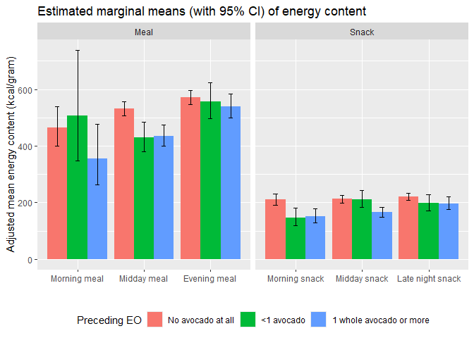<!-- -->

### Effect of preceding avocado consumption on energy density

- The interaction between meal type and preceding avocado intake was not
  significant (p = 0.09),

- Among the covariates:

  - Age, sex, race/ethinicity, BMI, region, day of the week, and meal
    frequency were not statistically significant
  - Meal environment (p = 0.0002) and daily energy intake (p \<.0001)
    were highly significant
    - Meal environment: Significantly higher density for
      “Daycare/Party/Travelling/Other”
    - Daily energy intake: Energy density was positively associated with
      daily energy intake

- The table below presents estimated marginal means of energy density by
  preceding avocado intake, adjusted for all covariates in the model

  - Energy density tended to increase with greater avocado consumption,
    with a significant difference observed between meals containing no
    avocado and meals containing 1+ avocados in the preceding eating
    occasion (p = 0.012).

<table class="table" style="color: black; margin-left: auto; margin-right: auto;">

<thead>

<tr>

<th style="text-align:left;">

Preceding avocado intake
</th>

<th style="text-align:right;">

Adjusted mean
</th>

<th style="text-align:right;">

Lower 95% CL
</th>

<th style="text-align:right;">

Upper 95% CL
</th>

<th style="text-align:right;">

p-val: vs No avocado
</th>

<th style="text-align:right;">

p-val: vs \<1 avocado
</th>

</tr>

</thead>

<tbody>

<tr>

<td style="text-align:left;">

No avocado at all
</td>

<td style="text-align:right;">

2.19
</td>

<td style="text-align:right;">

2.14
</td>

<td style="text-align:right;">

2.24
</td>

<td style="text-align:right;">

</td>

<td style="text-align:right;">

</td>

</tr>

<tr>

<td style="text-align:left;">

\<1 avocado
</td>

<td style="text-align:right;">

2.32
</td>

<td style="text-align:right;">

2.19
</td>

<td style="text-align:right;">

2.45
</td>

<td style="text-align:right;">

0.1289
</td>

<td style="text-align:right;">

</td>

</tr>

<tr>

<td style="text-align:left;">

1 whole avocado or more
</td>

<td style="text-align:right;">

2.34
</td>

<td style="text-align:right;">

2.25
</td>

<td style="text-align:right;">

2.43
</td>

<td style="text-align:right;">

0.0118
</td>

<td style="text-align:right;">

0.9730
</td>

</tr>

</tbody>

</table>

### Effect of preceding avocado consumption on mealtime interval

- The interaction between meal type and preceding avocado intake was
  highly significant (p = 0.0003),

  - suggesting that the effects of preceding avocado intake on meal
    interval differed across meal types

- Among the covariates:

  - Age, race/ethinicity, BMI, region, day of the week, meal
    environment, and daily kcal were not significant
  - Sex and meal frequenc were both highly significant (p \<.0001)
    - Sex: Males had longer meal intervals
    - Meal frequency: Higher the frequency, shorter the interval

- The table below presents estimated marginal means of meal interval
  (hours) by meal type and preceding avocado intake category, adjusted
  for all covariates in the model

- Meals:

  - For morning meals, there were no significant differences in meal
    interval by preceding avocado intake
  - For midday meals, prior consumption of 1+ avocados was associated
    with a significantly longer mealtime interval compared to no prior
    avocado consumption
  - Among evening meals, prior consumption of any amouhnt of avocado was
    associated with a significantly longer mealtime interval compared to
    no prior avocado consumption. No significant differences in interval
    was observed between \<1 avocado and 1+ avocados at the preceding
    eating occasion

- For snacks, no significant differences were observed across any
  period, including morning, midday, and late-night snacks

<table class="table" style="color: black; margin-left: auto; margin-right: auto;">

<thead>

<tr>

<th style="text-align:left;">

Meal type
</th>

<th style="text-align:left;">

Preceding avocado intake
</th>

<th style="text-align:right;">

Adjusted mean
</th>

<th style="text-align:right;">

Lower 95% CL
</th>

<th style="text-align:right;">

Upper 95% CL
</th>

<th style="text-align:right;">

p-val: vs No avocado
</th>

<th style="text-align:right;">

p-val: vs \<1 avocado
</th>

</tr>

</thead>

<tbody>

<tr>

<td style="text-align:left;vertical-align: top !important;" rowspan="3">

Morning meal
</td>

<td style="text-align:left;">

No avocado at all
</td>

<td style="text-align:right;">

3.12
</td>

<td style="text-align:right;">

2.73
</td>

<td style="text-align:right;">

3.51
</td>

<td style="text-align:right;">

</td>

<td style="text-align:right;">

</td>

</tr>

<tr>

<td style="text-align:left;">

\<1 avocado
</td>

<td style="text-align:right;">

3.41
</td>

<td style="text-align:right;">

2.43
</td>

<td style="text-align:right;">

4.39
</td>

<td style="text-align:right;">

0.8513
</td>

<td style="text-align:right;">

</td>

</tr>

<tr>

<td style="text-align:left;">

1 whole avocado or more
</td>

<td style="text-align:right;">

2.48
</td>

<td style="text-align:right;">

1.65
</td>

<td style="text-align:right;">

3.30
</td>

<td style="text-align:right;">

0.3475
</td>

<td style="text-align:right;">

0.3238
</td>

</tr>

<tr>

<td style="text-align:left;vertical-align: top !important;" rowspan="3">

Midday meal
</td>

<td style="text-align:left;">

No avocado at all
</td>

<td style="text-align:right;">

3.75
</td>

<td style="text-align:right;">

3.63
</td>

<td style="text-align:right;">

3.87
</td>

<td style="text-align:right;">

</td>

<td style="text-align:right;">

</td>

</tr>

<tr>

<td style="text-align:left;">

\<1 avocado
</td>

<td style="text-align:right;">

4.12
</td>

<td style="text-align:right;">

3.81
</td>

<td style="text-align:right;">

4.43
</td>

<td style="text-align:right;">

0.0782
</td>

<td style="text-align:right;">

</td>

</tr>

<tr>

<td style="text-align:left;">

1 whole avocado or more
</td>

<td style="text-align:right;">

4.31
</td>

<td style="text-align:right;">

4.09
</td>

<td style="text-align:right;">

4.53
</td>

<td style="text-align:right;">

\<0.0001
</td>

<td style="text-align:right;">

0.5859
</td>

</tr>

<tr>

<td style="text-align:left;vertical-align: top !important;" rowspan="3">

Evening meal
</td>

<td style="text-align:left;">

No avocado at all
</td>

<td style="text-align:right;">

4.51
</td>

<td style="text-align:right;">

4.40
</td>

<td style="text-align:right;">

4.62
</td>

<td style="text-align:right;">

</td>

<td style="text-align:right;">

</td>

</tr>

<tr>

<td style="text-align:left;">

\<1 avocado
</td>

<td style="text-align:right;">

5.01
</td>

<td style="text-align:right;">

4.71
</td>

<td style="text-align:right;">

5.31
</td>

<td style="text-align:right;">

0.0059
</td>

<td style="text-align:right;">

</td>

</tr>

<tr>

<td style="text-align:left;">

1 whole avocado or more
</td>

<td style="text-align:right;">

4.94
</td>

<td style="text-align:right;">

4.73
</td>

<td style="text-align:right;">

5.15
</td>

<td style="text-align:right;">

0.0007
</td>

<td style="text-align:right;">

0.9310
</td>

</tr>

<tr>

<td style="text-align:left;vertical-align: top !important;" rowspan="3">

Morning snack
</td>

<td style="text-align:left;">

No avocado at all
</td>

<td style="text-align:right;">

2.95
</td>

<td style="text-align:right;">

2.71
</td>

<td style="text-align:right;">

3.19
</td>

<td style="text-align:right;">

</td>

<td style="text-align:right;">

</td>

</tr>

<tr>

<td style="text-align:left;">

\<1 avocado
</td>

<td style="text-align:right;">

3.62
</td>

<td style="text-align:right;">

3.06
</td>

<td style="text-align:right;">

4.17
</td>

<td style="text-align:right;">

0.0755
</td>

<td style="text-align:right;">

</td>

</tr>

<tr>

<td style="text-align:left;">

1 whole avocado or more
</td>

<td style="text-align:right;">

3.06
</td>

<td style="text-align:right;">

2.62
</td>

<td style="text-align:right;">

3.50
</td>

<td style="text-align:right;">

0.8988
</td>

<td style="text-align:right;">

0.2684
</td>

</tr>

<tr>

<td style="text-align:left;vertical-align: top !important;" rowspan="3">

Midday snack
</td>

<td style="text-align:left;">

No avocado at all
</td>

<td style="text-align:right;">

3.02
</td>

<td style="text-align:right;">

2.86
</td>

<td style="text-align:right;">

3.19
</td>

<td style="text-align:right;">

</td>

<td style="text-align:right;">

</td>

</tr>

<tr>

<td style="text-align:left;">

\<1 avocado
</td>

<td style="text-align:right;">

2.93
</td>

<td style="text-align:right;">

2.57
</td>

<td style="text-align:right;">

3.30
</td>

<td style="text-align:right;">

0.8991
</td>

<td style="text-align:right;">

</td>

</tr>

<tr>

<td style="text-align:left;">

1 whole avocado or more
</td>

<td style="text-align:right;">

2.88
</td>

<td style="text-align:right;">

2.62
</td>

<td style="text-align:right;">

3.14
</td>

<td style="text-align:right;">

0.6337
</td>

<td style="text-align:right;">

0.9695
</td>

</tr>

<tr>

<td style="text-align:left;vertical-align: top !important;" rowspan="3">

Late night snack
</td>

<td style="text-align:left;">

No avocado at all
</td>

<td style="text-align:right;">

3.00
</td>

<td style="text-align:right;">

2.85
</td>

<td style="text-align:right;">

3.14
</td>

<td style="text-align:right;">

</td>

<td style="text-align:right;">

</td>

</tr>

<tr>

<td style="text-align:left;">

\<1 avocado
</td>

<td style="text-align:right;">

2.81
</td>

<td style="text-align:right;">

2.43
</td>

<td style="text-align:right;">

3.19
</td>

<td style="text-align:right;">

0.6434
</td>

<td style="text-align:right;">

</td>

</tr>

<tr>

<td style="text-align:left;">

1 whole avocado or more
</td>

<td style="text-align:right;">

2.84
</td>

<td style="text-align:right;">

2.53
</td>

<td style="text-align:right;">

3.15
</td>

<td style="text-align:right;">

0.6371
</td>

<td style="text-align:right;">

0.9932
</td>

</tr>

</tbody>

</table>

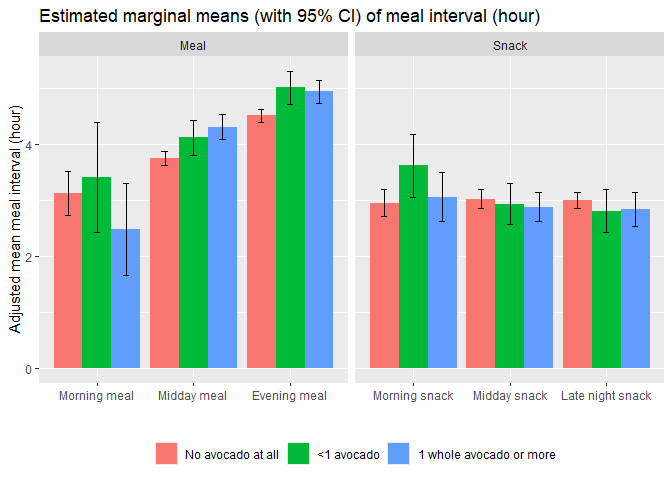<!-- -->
